# Agrometeorological Station

      

Welcome to the repository of my **Agrometeorological Station**. 
This project documents the evolution of the system, showing the transition from handmade DIY prototypes to the design of a custom stand-alone Printed Circuit Board (PCB).

  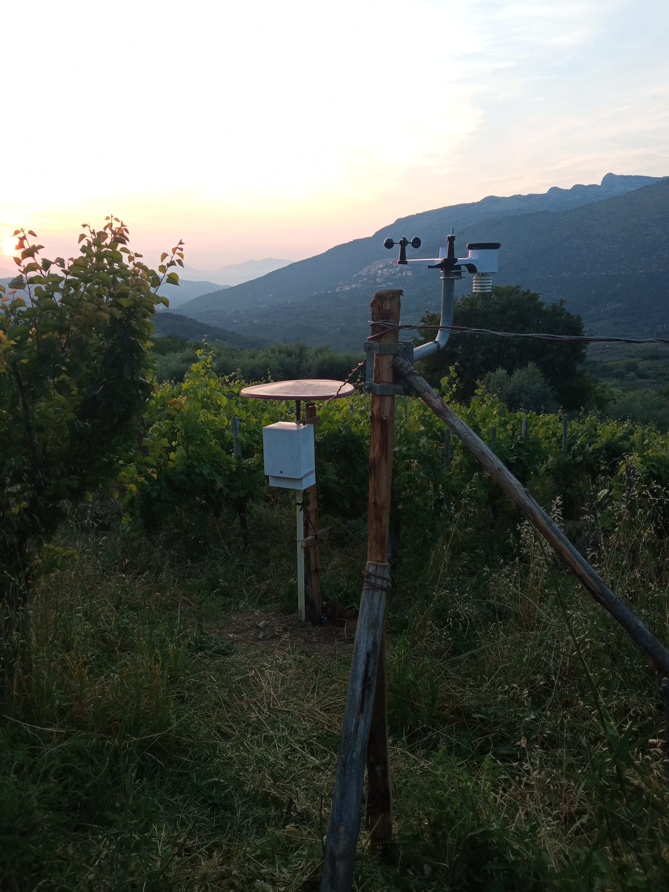

---

## Data Visualization
All versions of this station send telemetry data to a server.
I developed an interactive dashboard on **ThingsBoard** for real-time monitoring of environmental and agricultural parameters.

  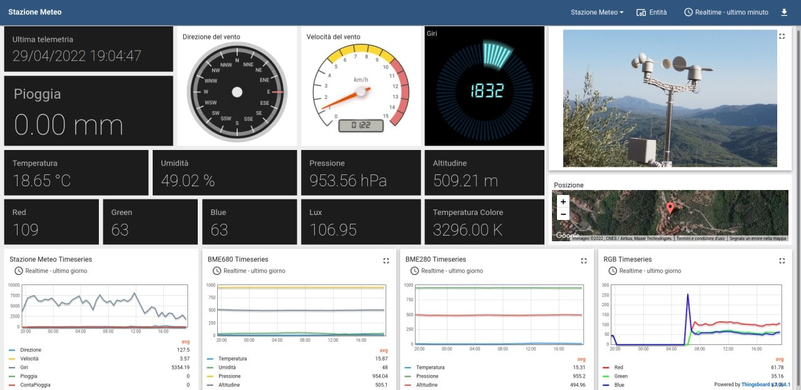

---

## The Hardware & Software Journey

The project is structured into three iterations, each focused on a specific improvement: computing power, off-grid autonomy, and total hardware integration.

### [Version 1: The Foundations (Raspberry Pi 4)](v1/)
The initial goal was to build a first, fully functional working prototype of a Weather Station using the Raspberry Pi 4 as the core platform.

* **Source Code:** [Python scripts](v1/code/)
* **Hardware Design:** [EasyEDA/Gerber Files](v1/EasyEDA_Files/) and [PDF Schematic](v1/Schematic_ShieldPi4_WS.pdf)

  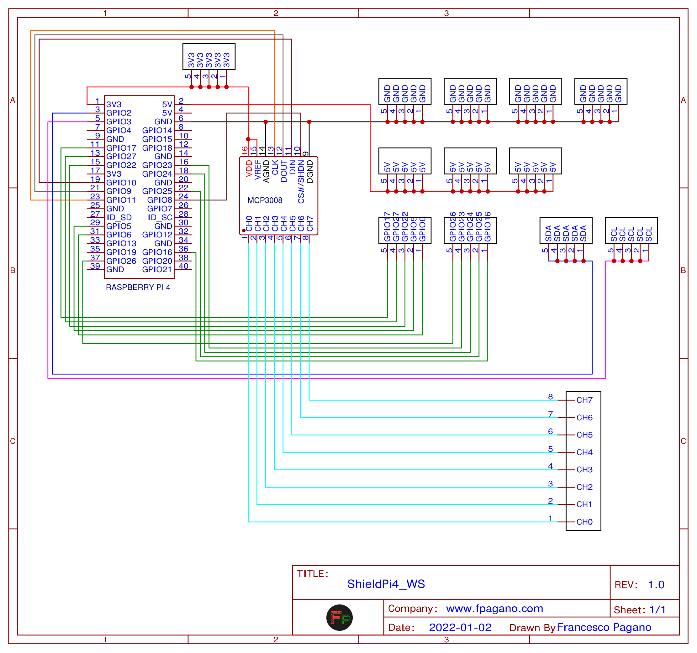
  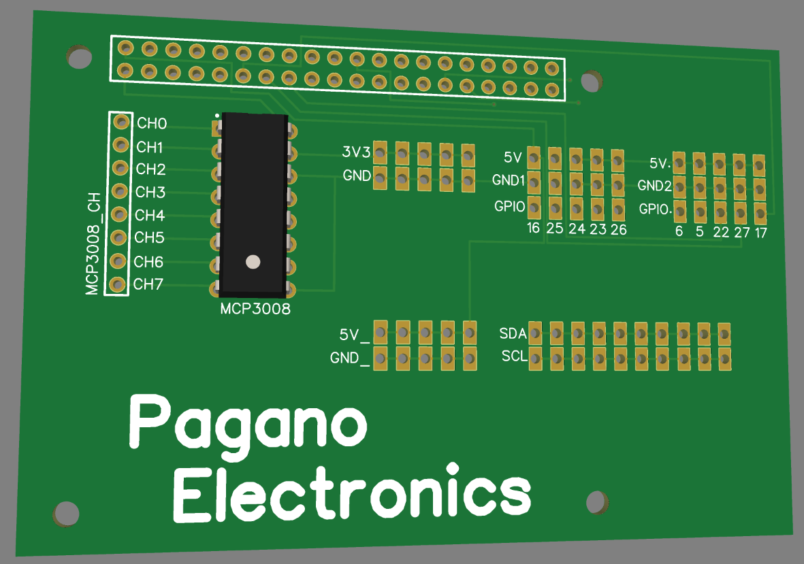
  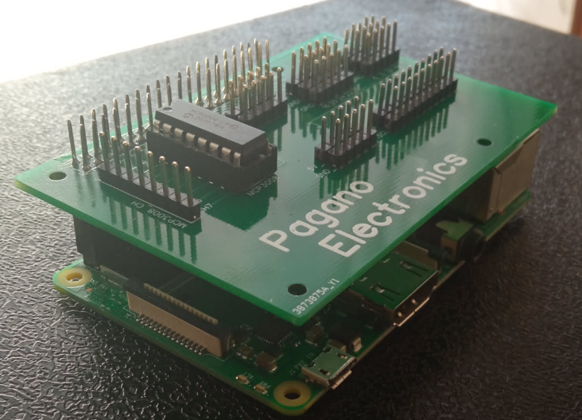
   <i>From left: Schematic, 3D Render, and assembled PCB on RPi4.</i>

---

### [Version 2: Miniaturization & Field Deployment (RPi Zero)](v2/)
In the second version, I focused on energy optimization and physical robustness for field deployment. 
I switched to the **Raspberry Pi Zero W** and introduced standard **RJ11** connectors for commercial weather sensors (plug-and-play).

* **Source Code:** [Python scripts](v2/code/)
* **Hardware Design:** [EasyEDA/Gerber Files](v2/EasyEDA_Files/) and [PDF Schematic](v2/Schematic_ShieldPi0_WS.pdf)

  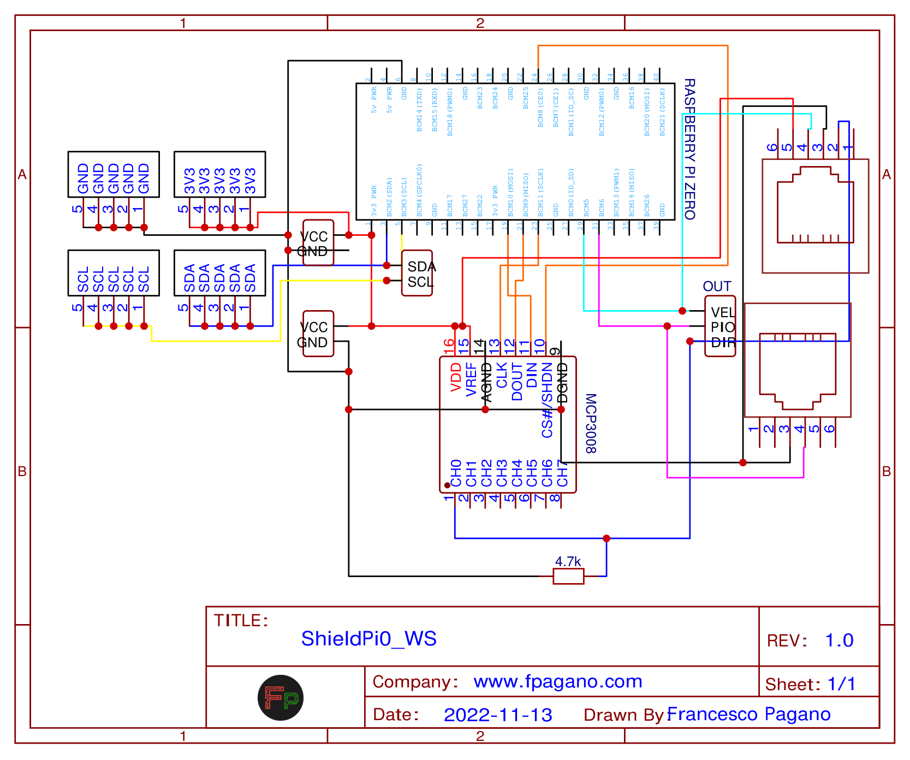
  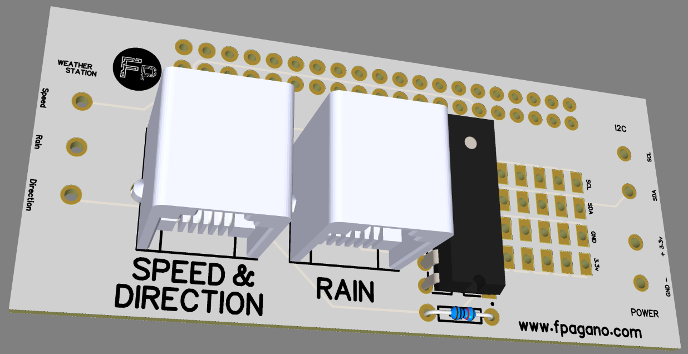
  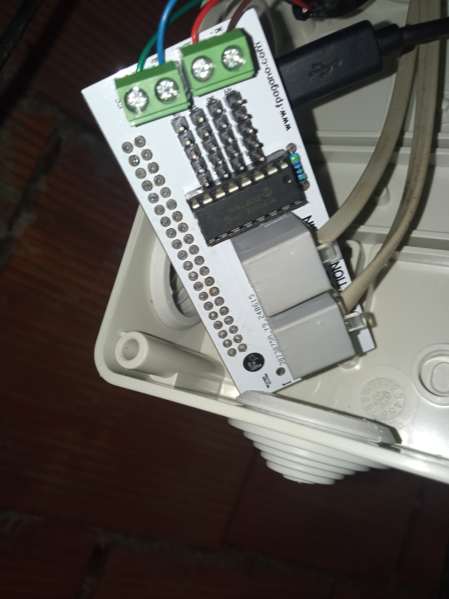
   <i>From left: Schematic, 3D Render, and assembled PCB.</i>

---

### [Version 3: Industrial IoT, LoRa & Solar Autonomy](v3/)
The third iteration introduces long-range communication and off-grid energy independence. 
The system is powered by a solar panel with an **MPPT** charge controller. I used two **Heltec LoRa 32 v2** (ESP32) modules for radio transmission and integrated a leaf wetness sensor via **RS485**.

* **Firmware Code:** [C++ sketches](v3/code/)
* **Hardware Design:** [EasyEDA/Gerber Files](v3/EasyEDA_Files/) and [PDF Schematic](v3/Schematic_ShieldHeltec_WS.pdf)

  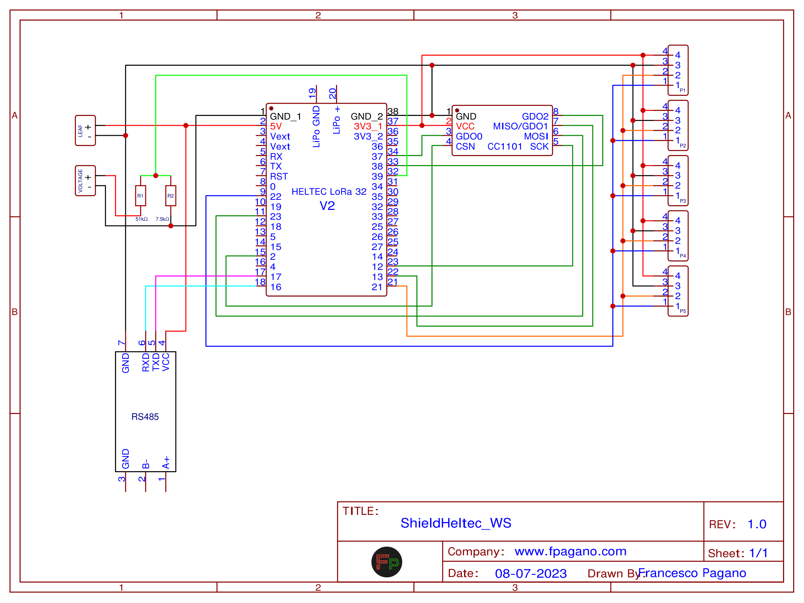
  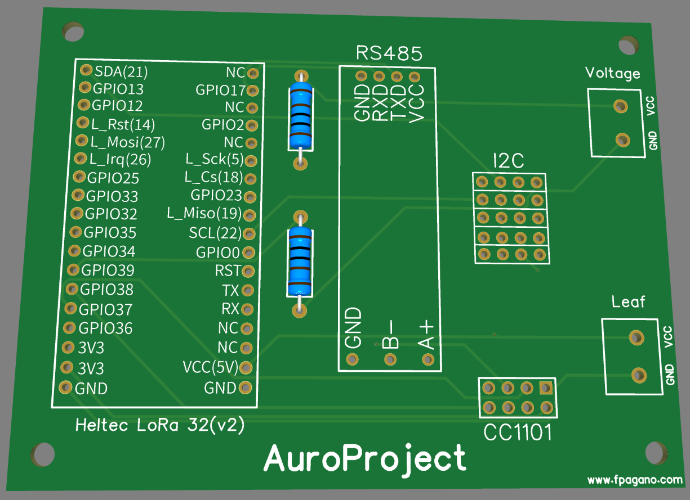
  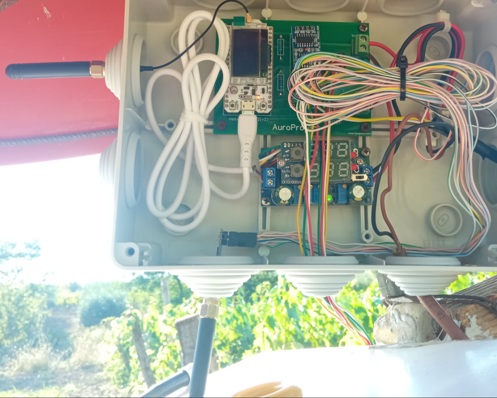
   <i>From left: Schematic, 3D Render, and final Enclosure.</i>

---

### [Version 4: The Stand-Alone Custom PCB (WIP)](v4/)
The state of the art and the natural evolution of the project. 
In this version, currently under development, I am abandoning the concept of a "Shield" connected to a third-party dev-board.  
I designed a single printed circuit board that directly integrates the **ESP8266** SoC (ESP-12F module). 
This "all-in-one" approach drastically reduces production costs, power consumption, and physical footprint, representing a true hardware product ready for industrialization.

* **Hardware Design:** [Work In Progress - EasyEDA Files](v4/EasyEDA_Files/)
* **Schematics:** [PDF of the WIP schematic](v4/Schematic_ESP8266_WS.pdf)

  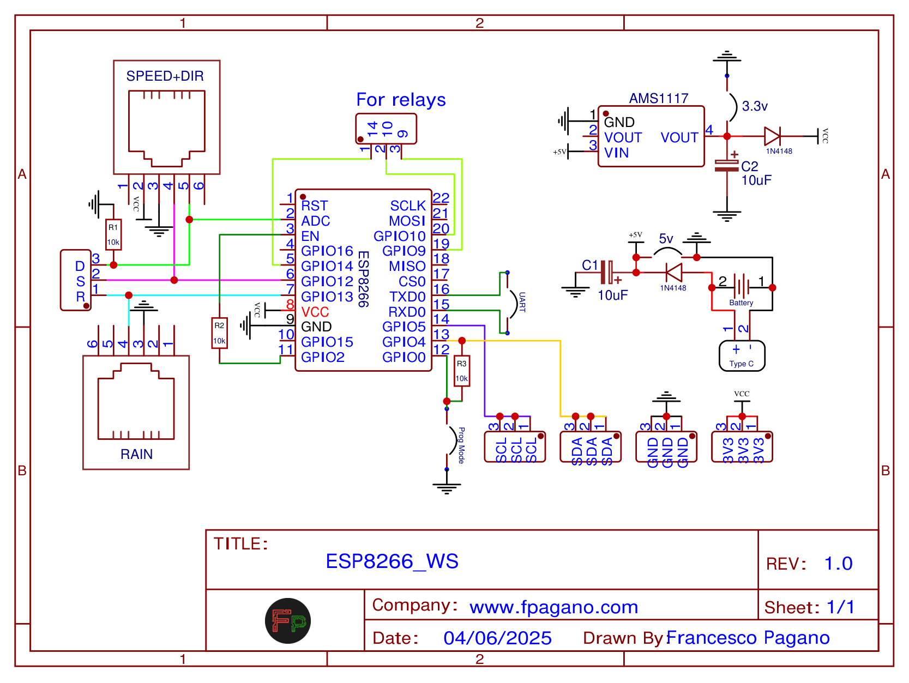
  &nbsp;&nbsp;&nbsp;&nbsp;
  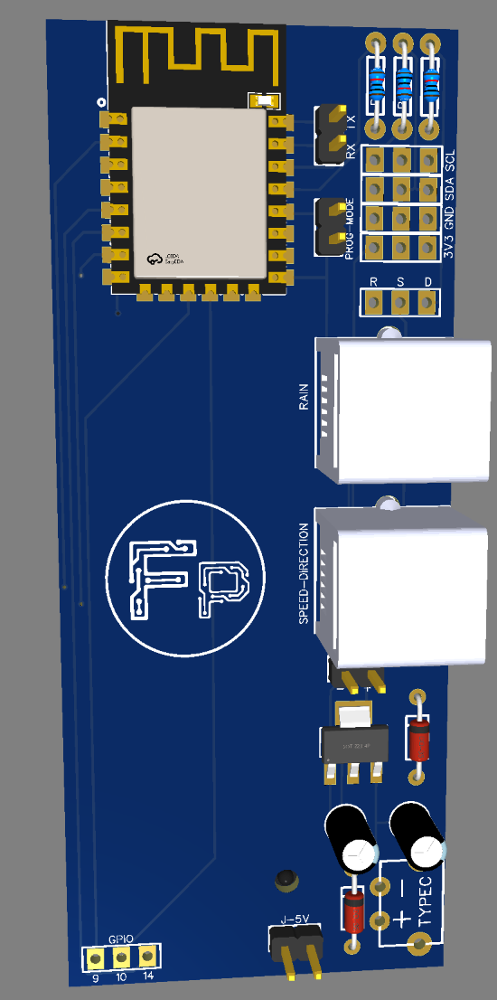
   <i>Left: Schematic. Right: 3D Render of the PCB.</i>

---

## Author
**Francesco Pagano**
* [LinkedIn](https://www.linkedin.com/in/francescopagano-/)
* [Website](http://www.fpagano.com)